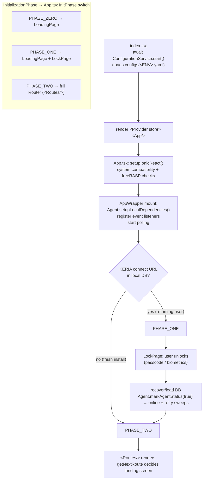
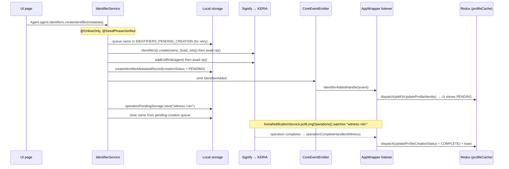
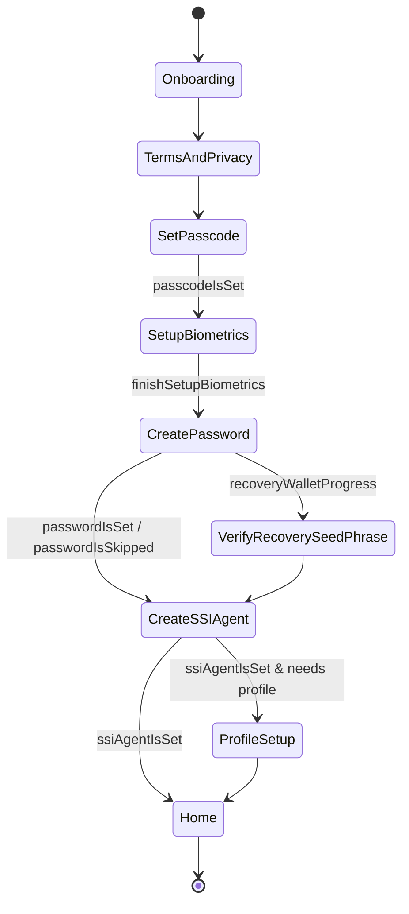

# Architecture Overview

This document explains **how the Veridian Wallet app is built** — its layers, the
responsibilities of each part of `src/`, and the data flows that tie them together. It is
aimed at developers who are new to the codebase and want a map before diving in.

> **Scope.** This is a *contributor*-facing document about the code in this repository. For
> *user*-facing documentation and conceptual background on KERI infrastructure, see
> <https://docs.veridian.id/>. For the reliability/retry design of the core, see
> [`docs/core/DistributedReliability.md`](./core/DistributedReliability.md).

## Table of contents
- [The big picture](#the-big-picture)
- [Technology stack](#technology-stack)
- [Repository layout](#repository-layout)
- [The three layers](#the-three-layers)
  - [1. Core (`src/core`)](#1-core-srccore)
  - [2. State (`src/store`)](#2-state-srcstore)
  - [3. UI & routing (`src/ui`, `src/routes`)](#3-ui--routing-srcui-srcroutes)
  - [The `AppWrapper` bridge](#the-appwrapper-bridge)
- [App bootstrap](#app-bootstrap)
- [Flow: creating an identifier (end to end)](#flow-creating-an-identifier-end-to-end)
- [Navigation as a state machine](#navigation-as-a-state-machine)
- [Cross-cutting concerns](#cross-cutting-concerns)
- [Glossary](#glossary)

## The big picture

Veridian Wallet is a **single-page React application** that is shipped three ways from one
codebase:

- as a **web app** (the `npm run dev` server, used for development), and
- as **native iOS and Android apps**, where the same web build runs inside a system WebView
  via **[Capacitor](https://capacitorjs.com/)**. Native capabilities (biometrics, secure
  storage, SQLite, camera/barcode, splash screen, etc.) are reached through Capacitor plugins.

Architecturally the app is three layers with a strict dependency direction:

```
┌──────────────────────────────────────────────────────────┐
│  UI  (src/ui, src/routes)   React + Ionic components,      │
│                             pages, hooks, routing          │
│        │  reads/dispatches            ▲ renders from       │
│        ▼                              │                    │
│  STATE (src/store)          Redux Toolkit slices          │
│        ▲  events bridged to dispatch                       │
│        │                                                   │
│  CORE (src/core)            Agent + services + records +   │
│                             storage + KERIA/Signify        │
└──────────────────────────────────────────────────────────┘
                    │ Signify-TS (signed requests)
                    ▼
            KERIA cloud agent  +  KERI witnesses  +  Cardano
```

The UI depends on the core; the core never depends on the UI. The core communicates with a
remote **KERIA cloud agent** through the **Signify-TS** client. Because Signify is stateless
and many user actions require several remote calls plus local writes, the core is built around
**idempotent, retryable operations** rather than transactions — see
[`DistributedReliability.md`](./core/DistributedReliability.md).

## Technology stack

| Concern | Choice |
|---|---|
| Language | TypeScript (`strict`) |
| UI framework | React + **Ionic React** (`@ionic/react`) |
| Native shell | **Capacitor** (native projects in `android/`, `ios/`) |
| State | **Redux Toolkit** + `react-redux` |
| Routing | `react-router-dom` via `@ionic/react-router` |
| Identity client | **Signify-TS** (talks to KERIA) |
| Local DB | encrypted SQLite on native; IndexedDB on web — selected at runtime in `Agent` |
| Secure secrets | Keychain / Keystore via `SecureStorage` |
| Biometrics | Capacitor native-biometric plugin |
| Hardening (RASP) | freeRASP, toggled by `security.rasp.enabled` |
| i18n | `i18next` + `react-i18next` (strings in `src/locales/`) |
| Build | **Webpack** |
| Unit tests | **Jest** + Testing Library |
| E2E tests | **WebdriverIO + Appium** (see [`docs/Testing.md`](./Testing.md)) |

Exact versions and plugin packages live in `package.json` (`engines` pins the Node version).

## Repository layout

```
src/
├── index.tsx    App entry: loads config, mounts <App/> in the Redux <Provider>
├── core/        ── CORE LAYER ── Agent singleton, domain services, records + storage, KERIA/Signify
├── store/       ── STATE LAYER ── Redux Toolkit store + reducers (slices)
├── routes/      Route paths + the next/back navigation state machine
├── ui/          ── UI LAYER ── App root, pages, components, hooks, styles
├── native/      Push-notification glue
└── security/    freeRASP initialization

services/        Dev/test backends (NOT the wallet): credential issuance server + UI, CIP-45 dApp
configs/         Per-environment YAML (local / remote / prod)
android/, ios/   Capacitor native projects
tests/           WebdriverIO/Appium E2E suite
```

The three layers are described in the next section; deeper structure is best explored with grep
or the codebase graph rather than mirrored here.

## The three layers

### 1. Core (`src/core`)

The core is a UI-agnostic library for KERI identity, credentials, and connections. Its hub is
the **`Agent`** singleton (`src/core/agent/agent.ts`).

**`Agent` is a singleton accessed as `Agent.agent`.** It:

- Chooses a **storage session** at construction: `SqliteSession` on native, `IonicSession`
  (IndexedDB) on the web.
- Owns the **Signify client** lifecycle: `start()`, `bootAndConnect()` (boots a new KERIA
  agent and auto-discovers the connect URL), `recoverKeriaAgent()` (restores from a seed
  phrase), `connect()` (auto-retrying reconnect).
- Exposes **domain services as lazy getters** — `agent.identifiers`, `agent.connections`,
  `agent.credentials`, `agent.ipexCommunications`, `agent.multiSigs`,
  `agent.keriaNotifications`, `agent.auth`. Each service is constructed on first access and
  wired with the storage repositories and other services it needs.
- Provides the **online/offline switch**, `markAgentStatus(online)`. Going online emits a
  `KeriaStatusChanged` event **and triggers the retry sweeps** —
  `processIdentifiersPendingCreation()`, `removeConnectionsPendingDeletion()`,
  `processGroupsPendingCreation()`, etc. This is the runtime expression of the
  idempotency/retry model.
- Enforces **seed-phrase verification**: critical actions are counted
  (`recordCriticalAction`) and the wallet requires the user to verify their recovery phrase
  within a deadline (2 weeks, reduced to 1 day after 5 critical actions).

The **services** (`src/core/agent/services/`) are the "pluggable API for the UI" (see that
folder's README). Each owns one domain — e.g. `IdentifierService`, `ConnectionService`,
`CredentialService`, `IpexCommunicationService` (credential exchange via IPEX),
`MultiSigService` (group identifiers), `KeriaNotificationService` (polling + dispatch of KERIA
notifications and long-running operations), `AuthService`. Common cross-cutting behavior is
applied with decorators such as `@OnlineOnly` and `@SeedPhraseVerified`.

The **records** (`src/core/agent/records/`) are the local persistence layer: a `*Record`
type paired with a `*Storage` repository over the chosen storage session. `BasicStorage`
(key/value-ish `BasicRecord`s) is used heavily for app flags and the retry queues (e.g.
`IDENTIFIERS_PENDING_CREATION`). `OperationPendingStorage` tracks in-flight KERIA operations
(see the identifier flow below). When adding a record type, set defaults inside the
`if (props)` block of the constructor — see `records/README.md`.

The **event bus** (`src/core/agent/event.ts`) is a thin wrapper over Node's `EventEmitter`.
The core emits typed events (`IdentifierAdded`, `NotificationAdded`, `KeriaStatusChanged`,
operation completion/failure, connection/ACDC state changes, …). The UI subscribes to these
in `AppWrapper` and translates them into Redux dispatches — this is how the core stays
ignorant of the UI.

### 2. State (`src/store`)

A standard Redux Toolkit store (`src/store/index.ts`); typed hooks `useAppDispatch` /
`useAppSelector` in `src/store/hooks.ts`. The slices in `src/store/reducers/`:

| Slice | Responsibility |
|---|---|
| `stateCache` | The app's control state: `initializationPhase`, `authentication` flags (passcode/biometrics/password/SSI-agent set), the navigation `routes` stack + `currentRoute`, online status, incoming-request queue, toasts, alerts |
| `profileCache` | The user's identities/profiles, connections cache, credentials cache, the current & recent profiles, connected dApp |
| `seedPhraseCache` | Transient seed phrase during onboarding/recovery |
| `biometricsCache` | Whether biometrics are enabled |
| `notificationsPreferences` | Notification configuration/enablement |
| `viewTypeCache` | Card vs list view, credential favourites |

`stateCache.authentication` and `profileCache.currentProfile` are the inputs that drive
navigation (next section). `stateCache.initializationPhase` drives which top-level screen the
app shows (see [App bootstrap](#app-bootstrap)).

### 3. UI & routing (`src/ui`, `src/routes`)

`src/ui/App.tsx` is the root component. It calls `setupIonicReact()`, runs a system
compatibility check (minimum OS/WebView versions) and freeRASP threat check, and then renders
the app according to `stateCache.initializationPhase` via the `InitPhase` switch.

**Pages** (`src/ui/pages/`) are full screens; **components** (`src/ui/components/`) are
reusable pieces. Roughly 65 components and 22 page directories exist, so lean on
`get_architecture`/`search_graph` (codebase graph) or grep to locate a specific one rather
than reading the tree.

**Routing** lives in `src/routes/`:

- `paths.ts` — `RoutePath` and `TabsRoutePath` enums (the URL constants). Authenticated
  content lives under `/tabs/*` (home, credentials, connections, notifications).
- `index.tsx` — the `Routes` component: an `IonRouterOutlet` mapping each path to a page.
- `nextRoute/` and `backRoute/` — **the navigation logic** (see
  [Navigation as a state machine](#navigation-as-a-state-machine)). Navigation is *computed
  from store state*, not hard-coded per page.

### The `AppWrapper` bridge

`src/ui/components/AppWrapper/AppWrapper.tsx` is where the layers are stitched together. On
mount it:

1. **Initializes core dependencies** (`Agent.setupLocalDependencies()` — opens the DB, builds
   the storage repositories and services).
2. **Registers core event listeners** (`setupEventServiceCallbacks`, using the handlers in
   `AppWrapper/coreEventListeners.ts`) that translate core events into Redux dispatches.
3. **Starts background polling** of KERIA notifications and long-running operations
   (`agent.keriaNotifications.pollNotifications()` / `pollLongOperations()`).
4. **Sets the initialization phase** and, after unlock/recovery, calls
   `Agent.markAgentStatus(true)` to go online (which kicks off the retry sweeps).

It also bridges Cardano dApp peer-connection events and ACDC/connection state changes into the
store. In short: **`AppWrapper` is the adapter that lets a UI-ignorant core drive a
core-ignorant Redux store.**

## App bootstrap



`PHASE_ZERO` is the initial loading state, `PHASE_ONE` means dependencies are ready but the
user must unlock (returning user), and `PHASE_TWO` is the fully-running app with the router
mounted.

## Flow: creating an identifier (end to end)

This single flow exercises every layer and shows the idempotency/retry model in action.



Key points:

- The display name is **persisted to a retry queue before any remote call**, and removed only
  after success. If the app dies mid-creation, `processIdentifiersPendingCreation()` (called
  on the next `markAgentStatus(true)`) finishes the job. Duplicate-creation errors from KERIA
  are caught and ignored, because the operation must be safe to repeat.
- The identifier is created **PENDING** with a tracked `operationPendingStorage` record
  (`witness.<id>`). A background poller resolves it to **COMPLETE** (or **FAILED**) later, and
  the result reaches the UI purely through the event bus → Redux bridge.

## Navigation as a state machine

Navigation is one of the least obvious parts of the codebase. Pages do **not** hard-code where
to go next. Instead, `src/routes/nextRoute/nextRoute.ts` defines a table:

```ts
const nextRoute: Record<string, NextRoute> = {
  [RoutePath.SET_PASSCODE]: {
    nextPath: (data) => getNextSetPasscodeRoute(data.store), // compute from store
    updateRedux: [updateStoreAfterSetPasscodeRoute],          // side effects to dispatch
  },
  // …one entry per route
};
```

A page calls `getNextRoute(currentPath, { store })`, which returns:
1. `nextPath` — the destination, **computed from `stateCache.authentication` and
   `profileCache.currentProfile`**, and
2. `updateRedux` — an array of action creators the caller dispatches (always including
   `updateStoreCurrentRoute`).

`backRoute/` is the mirror image for the back direction. The effect is a declarative
state machine: the onboarding path emerges from authentication flags rather than imperative
`history.push` calls scattered across pages.



(The diagram shows the happy path; group-profile and recovery branches add edges. The
authoritative source is `getNextRootRoute` and the `nextRoute` table.)

## Cross-cutting concerns

- **Storage backends.** `SecureStorage` (Keychain/Keystore) holds secrets like the Signify
  `bran` and app passcode. The encrypted SQLite DB (native) / IndexedDB (web) holds records.
  The backend is chosen at runtime in `Agent` based on `Capacitor.isNativePlatform()`.
- **Configuration.** `ConfigurationService.start()` dynamically imports `configs/<ENV>.yaml`
  (`ENVIRONMENT` = `local` | `remote` | `prod`) and validates it. `KERIA_IP` can override the
  KERIA host at runtime (used for emulators/simulators). See `src/core/configuration/`.
- **Security.** freeRASP (RASP) is initialized in `src/security/freerasp.ts` and toggled by
  `security.rasp.enabled`. Additional hardening: privacy screen + screenshot prevention and
  tap-jacking protection (Capacitor plugins, configured in `capacitor.config.ts`).
- **Localization.** i18next is fully wired (`src/i18n.ts`) and all UI copy is externalized
  into namespaced JSON under `src/locales/en/`. Today only English ships, and the active
  language is hard-coded (`lng: "en"`), so the registered language-detector is currently
  inert. Adding a locale is a code change (register the resource bundle in `i18n.ts`), not
  config.
- **Theming/branding.** The color palette is CSS custom properties in
  `src/ui/styles/colors.scss`. App name/bundle id live in `capacitor.config.ts` and the native
  projects; icons/splash are generated from `src/assets/` (see
  [`docs/Customizing-Splash-and-Icons.md`](./Customizing-Splash-and-Icons.md)).
- **dApp connectivity.** Cardano dApp pairing uses CIP-45 peer connect via
  `src/core/cardano/walletConnect/`; events are bridged to the store in `AppWrapper`.

## Glossary

These terms appear throughout the core. (For depth, see <https://docs.veridian.id/> and the
links in the project `README.md`.)

| Term | Meaning in this codebase |
|---|---|
| **KERI** | Key Event Receipt Infrastructure — the identity protocol underpinning the wallet |
| **KERIA** | The cloud **agent** the wallet connects to; runs the user's identity operations remotely |
| **Signify(-TS)** | The client library the core uses to send signed requests to KERIA |
| **bran** | The 21-character Signify passcode/salt that seeds the client; stored in `SecureStorage`, convertible to/from a BIP-39 mnemonic for recovery |
| **AID / identifier** | An autonomic identifier (KERI prefix). Single-sig or group multi-sig |
| **witness** | A KERI service that receipts key events; identifier creation tracks a `witness.<id>` operation until it completes |
| **OOBI** | Out-Of-Band Introduction — a URL used to discover/resolve another party |
| **ACDC** | Authentic Chained Data Container — the verifiable credential format |
| **IPEX** | Issuance and Presentation Exchange — the protocol for exchanging ACDCs (`IpexCommunicationService`) |
| **CESR** | Composable Event Streaming Representation — the wire encoding KERI/ACDC use |
| **operation (op)** | A long-running KERIA task; tracked locally via `OperationPendingStorage` and polled to completion |
