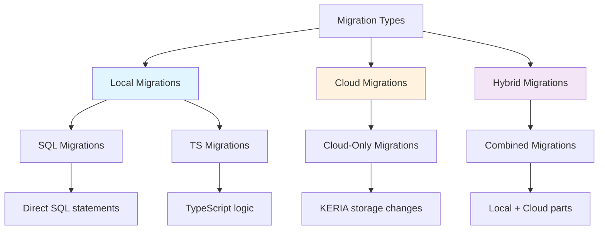
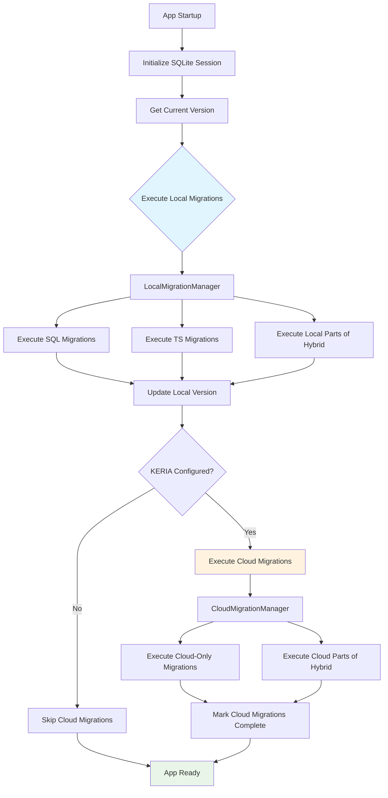
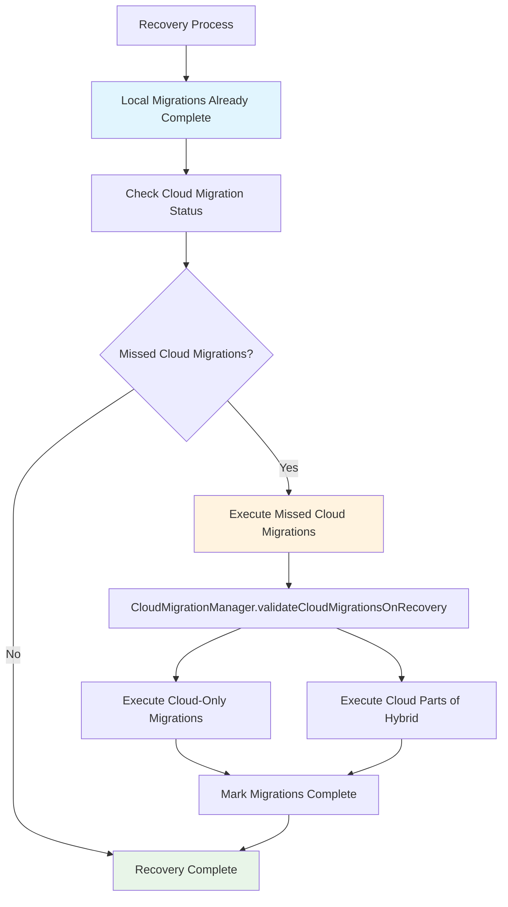
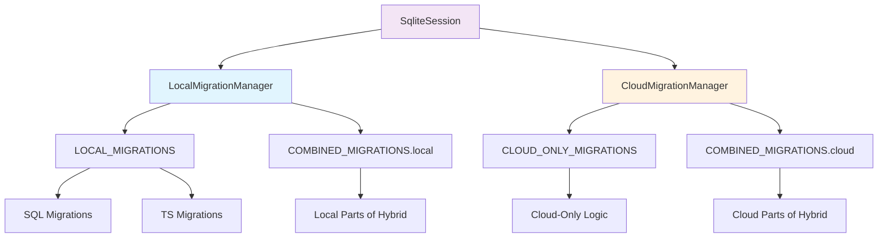
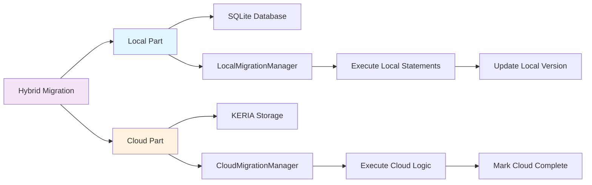
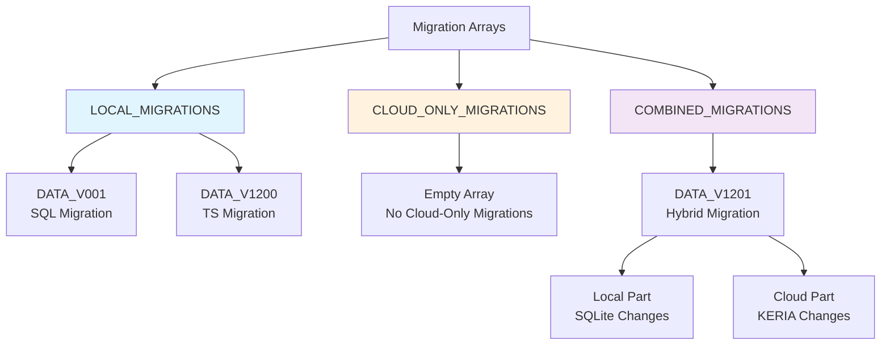
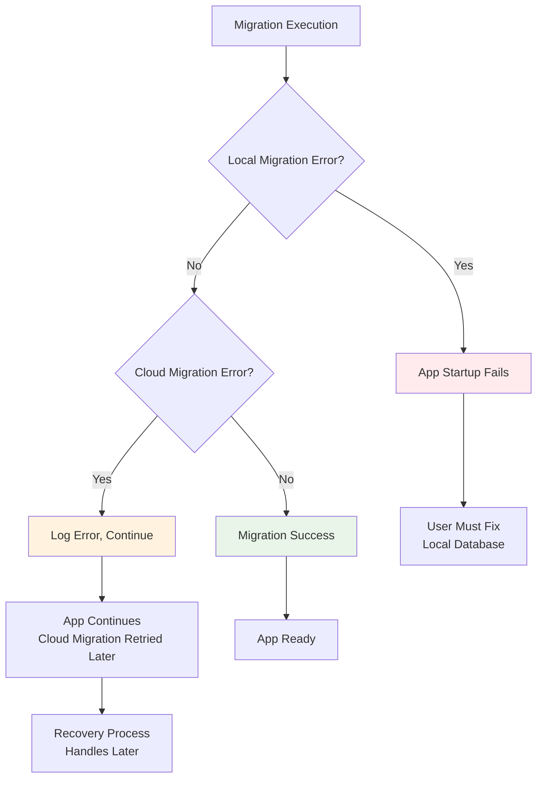
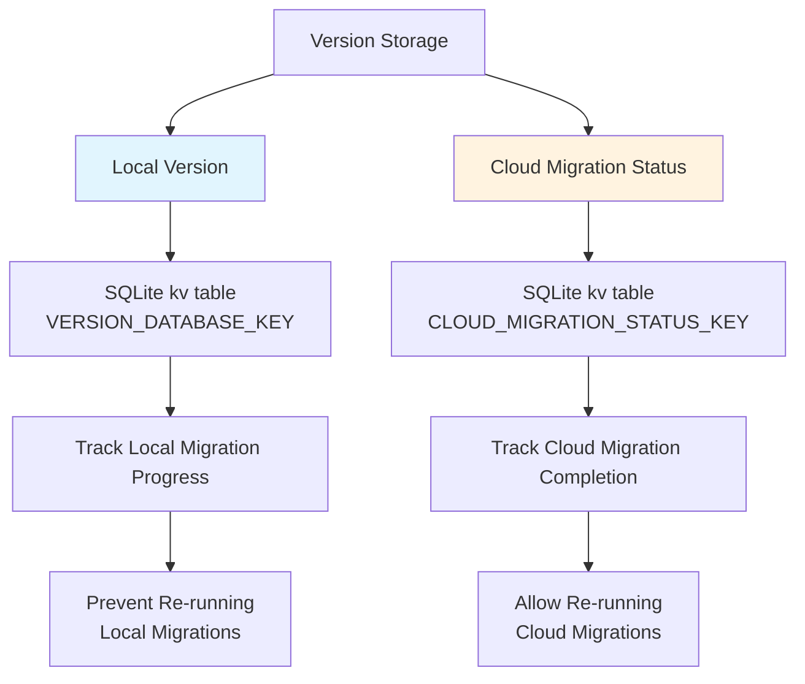
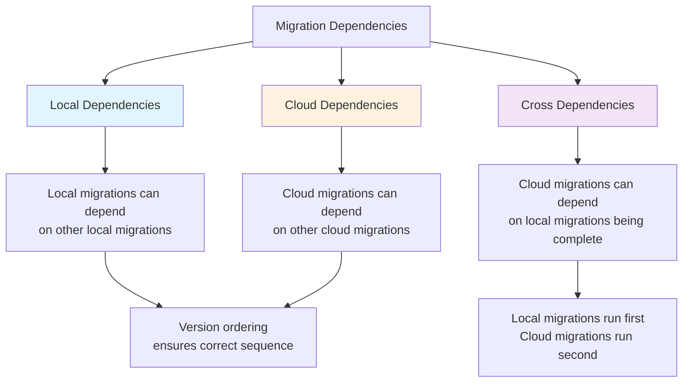

# Migration System Diagrams

## Overview

This document contains visual diagrams showing how the migration system works with the clear separation between local (SQLite) and cloud (KERIA) migrations.

## 1. Migration Types Overview

## 2. Migration Execution Flow

## 3. Recovery Flow

## 4. Migration Manager Architecture

## 5. Data Flow for Hybrid Migrations

## 6. Migration Arrays Organization

## 7. Error Handling Flow

## 8. Version Management

## 9. Migration Dependencies

## Color Legend

- **Blue (#e1f5fe)**: Local/SQLite operations
- **Orange (#fff3e0)**: Cloud/KERIA operations  
- **Purple (#f3e5f5)**: Hybrid/Combined operations
- **Green (#e8f5e8)**: Success/Completion states
- **Red (#ffebee)**: Error states

## Key Benefits of This Architecture

1. **Clear Separation**: Local and cloud migrations are completely decoupled
2. **Independent Execution**: Cloud migrations can be retried without affecting local migrations
3. **Recovery Resilience**: Missed cloud migrations are automatically detected and executed
4. **Type Safety**: Strong typing ensures correct migration categorization
5. **Maintainability**: Each migration manager has a single responsibility
6. **Scalability**: Easy to add new migration types or modify existing ones 